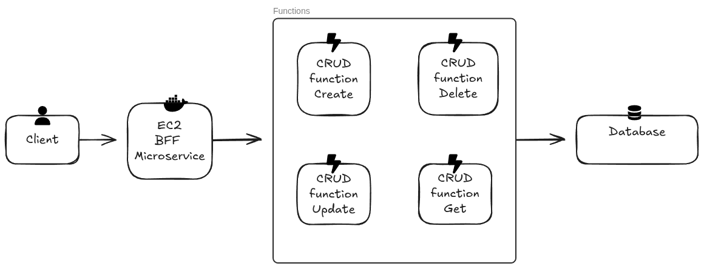
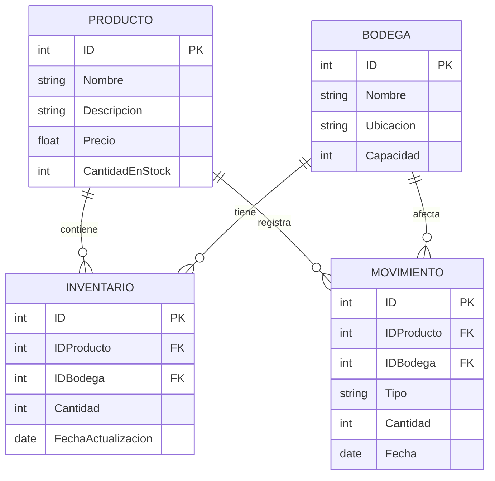

# Sistema Inventario - Bodegas Agranelos

## Arquitectura del Sistema

La arquitectura del sistema de inventario está diseñada para ser modular, escalable y eficiente, aprovechando tecnologías modernas de desarrollo y despliegue de servicios en la nube con un patrón de microservicios y funciones serverless.

### Componentes Principales:

1. **Microservicio BFF (Backend For Frontend)**
   - Desarrollado en Java con Spring Boot 3.1.2
   - Actúa como intermediario que orquesta las llamadas a las funciones serverless
   - Expone APIs RESTful unificadas para productos y bodegas
   - Incluye validación, manejo de errores y documentación OpenAPI/Swagger
   - Contenedorizado con Docker para fácil despliegue

2. **Funciones Serverless (Azure Functions)**
   - Implementadas en Java para manejar operaciones específicas de negocio
   - **Funciones implementadas:**
     - **Productos**: CRUD completo (GetProductos, GetProductoById, CreateProducto, UpdateProducto, DeleteProducto)
     - **Bodegas**: CRUD completo (GetBodegas, GetBodegaById, CreateBodega, UpdateBodega, DeleteBodega)
     - **Utilidades**: InitializeDatabase para inicialización del sistema
   - Configuradas con HTTP Triggers para invocación vía API REST

3. **Base de Datos PostgreSQL**
   - Esquema completo con tablas: PRODUCTO, BODEGA, INVENTARIO, MOVIMIENTO
   - Conexión via HikariCP para pooling de conexiones
   - Datos de prueba incluidos para desarrollo y testing

4. **Comunicación y Flujo de Datos:**
   - Las solicitudes del cliente son recibidas por el Microservicio BFF
   - El BFF procesa las solicitudes y delega a las funciones serverless correspondientes
   - Las funciones serverless ejecutan las operaciones en la base de datos
   - El BFF responde al cliente con los resultados procesados en formato JSON



## Base de Datos



## Funciones Implementadas

El sistema expone los siguientes endpoints a través del microservicio BFF y las funciones serverless:

### Microservicio BFF (Puerto 8080)
Endpoints principales del Backend For Frontend:

| Verbo  | Ruta BFF                       | Descripción                        |
| :----- | :---------------------------- | :--------------------------------- |
| `GET`  | `/api/v1/productos`           | Obtiene todos los productos (orquesta llamada a función serverless). |
| `GET`  | `/api/v1/productos/{id}`      | Obtiene un producto específico por ID. |
| `POST` | `/api/v1/productos`           | Crea un nuevo producto.            |
| `PUT`  | `/api/v1/productos/{id}`      | Actualiza un producto existente.   |
| `DELETE`| `/api/v1/productos/{id}`     | Elimina un producto.               |
| `GET`  | `/api/v1/bodegas`             | Obtiene todas las bodegas.         |
| `GET`  | `/api/v1/bodegas/{id}`        | Obtiene una bodega específica por ID. |
| `POST` | `/api/v1/bodegas`             | Crea una nueva bodega.             |
| `PUT`  | `/api/v1/bodegas/{id}`        | Actualiza una bodega existente.    |
| `DELETE`| `/api/v1/bodegas/{id}`       | Elimina una bodega.                |

### Funciones Serverless (Azure Functions)
Endpoints directos de las funciones serverless:

#### Productos
| Verbo  | Ruta                  | Descripción                        |
| :----- | :-------------------- | :--------------------------------- |
| `GET`  | `/api/productos`      | Obtiene la lista de todos los productos. |
| `GET`  | `/api/productos/{id}` | Obtiene un producto específico por su ID. |
| `POST` | `/api/productos`      | Crea un nuevo producto.            |
| `PUT`  | `/api/productos/{id}` | Actualiza un producto existente por su ID. |
| `DELETE`| `/api/productos/{id}`| Elimina un producto por su ID.     |

#### Bodegas
| Verbo  | Ruta                  | Descripción                        |
| :----- | :-------------------- | :--------------------------------- |
| `GET`  | `/api/bodegas`        | Obtiene la lista de todas las bodegas. |
| `GET`  | `/api/bodegas/{id}`   | Obtiene una bodega específica por su ID. |
| `POST` | `/api/bodegas`        | Crea una nueva bodega.             |
| `PUT`  | `/api/bodegas/{id}`   | Actualiza una bodega existente por su ID. |
| `DELETE`| `/api/bodegas/{id}`  | Elimina una bodega por su ID.      |

#### Utilidades
| Verbo  | Ruta          | Descripción                        |
| :----- | :------------ | :--------------------------------- |
| `POST` | `/api/init`   | Inicializa la base de datos con esquemas y datos de prueba. |

### Documentación y Monitoreo
| Verbo  | Ruta                     | Descripción                        |
| :----- | :----------------------- | :--------------------------------- |
| `GET`  | `/swagger-ui.html`       | Interfaz interactiva Swagger UI del BFF. |
| `GET`  | `/v3/api-docs`           | Especificación OpenAPI JSON del BFF. |
| `GET`  | `/actuator/health`       | Health check del microservicio BFF. |

## Despliegue y Ejecución

### Prerrequisitos
- Java 17 o superior
- Maven 3.6+
- Docker y Docker Compose
- PostgreSQL 13+
- Azure Functions Core Tools (para desarrollo local)
- Nix (opcional, para entorno de desarrollo)

### Configuración de Base de Datos
1. **PostgreSQL Local**:
   ```bash
   # Ejecutar con Docker Compose
   docker-compose -f bff-microservice/docker-compose.yml up -d postgres
   ```

2. **Inicialización del esquema**:
   El esquema se crea automáticamente usando el archivo `schema.sql`. También puedes usar la función de inicialización:
   ```bash
   # Llamada POST a la función de inicialización
   curl -X POST http://localhost:7071/api/init
   ```

### Ejecución Local

#### Opción 1: Usando Nix (Recomendado)
```bash
# Entrar al entorno de desarrollo
nix develop

# Compilar y ejecutar funciones serverless
mvn clean package
func host start --java

# En otra terminal, ejecutar el microservicio BFF
cd bff-microservice
mvn spring-boot:run
```

#### Opción 2: Ejecución Manual
```bash
# 1. Compilar y ejecutar Azure Functions
mvn clean package
func host start --java

# 2. En otra terminal, ejecutar el microservicio BFF
cd bff-microservice
mvn clean package
mvn spring-boot:run
```

#### Opción 3: Usando Docker
```bash
# Ejecutar todo el stack
cd bff-microservice
docker-compose up --build

# Solo base de datos
docker-compose up -d postgres
```

### Acceso a la Aplicación
- **Microservicio BFF**: http://localhost:8080
- **Swagger UI**: http://localhost:8080/swagger-ui.html
- **Azure Functions**: http://localhost:7071
- **Health Check**: http://localhost:8080/actuator/health

### Pruebas
```bash
# Ejecutar pruebas de las funciones serverless
mvn test

# Ejecutar pruebas del microservicio BFF
cd bff-microservice
mvn test
```

### Despliegue en Producción

#### Azure Functions
```bash
# Compilar para producción
mvn clean package

# Despliegue en Azure (requiere Azure CLI configurado)
func azure functionapp publish <nombre-function-app> --java
```

#### Microservicio BFF
```bash
# Construir imagen Docker
cd bff-microservice
docker build -t agranelos-bff:latest .

# Ejecutar en producción
docker-compose -f docker-compose.yml up -d
```

### Variables de Entorno

#### Azure Functions (local.settings.json)
```json
{
  "IsEncrypted": false,
  "Values": {
    "AzureWebJobsStorage": "UseDevelopmentStorage=true",
    "FUNCTIONS_WORKER_RUNTIME": "java",
    "DB_CONNECTION_STRING": "jdbc:postgresql://localhost:5432/inventario_db?user=inventario_user&password=inventario_pass"
  }
}
```

#### Microservicio BFF (application.yml)
```yaml
server:
  port: 8080

functions:
  base-url: http://localhost:7071

spring:
  application:
    name: agranelos-bff
  profiles:
    active: local
```

## Estructura del Proyecto

```
agranelos-functions-crud-create/
├── src/                                    # Funciones serverless Azure
│   ├── main/java/com/agranelos/inventario/
│   │   ├── Function.java                   # Endpoints CRUD (productos y bodegas)
│   │   ├── db/                            # Gestión de base de datos
│   │   └── model/                         # Modelos de datos
│   └── test/                              # Pruebas unitarias
├── bff-microservice/                      # Microservicio BFF (Spring Boot)
│   ├── src/main/java/com/agranelos/bff/
│   │   ├── BffApplication.java            # Aplicación principal Spring Boot
│   │   ├── controller/                    # Controladores REST
│   │   ├── service/                       # Servicios de orquestación
│   │   ├── dto/                          # Objetos de transferencia de datos
│   │   └── config/                       # Configuración WebClient y OpenAPI
│   ├── src/test/                         # Pruebas del microservicio
│   ├── docker-compose.yml               # Docker Compose con PostgreSQL
│   ├── Dockerfile                        # Imagen Docker del BFF
│   └── pom.xml                           # Dependencias Spring Boot
├── schema.sql                            # Esquema de base de datos PostgreSQL
├── flake.nix                            # Entorno de desarrollo Nix
├── pom.xml                              # Build principal (Azure Functions)
├── host.json                            # Configuración Azure Functions
└── local.settings.json                  # Variables locales (no versionado)
```

## Configuración de Entornos

### Desarrollo Local
- **Azure Functions**: Puerto 7071
- **Microservicio BFF**: Puerto 8080
- **PostgreSQL**: Puerto 5432

### Variables de Entorno

#### Azure Functions (local.settings.json)
```json
{
  "IsEncrypted": false,
  "Values": {
    "AzureWebJobsStorage": "UseDevelopmentStorage=true",
    "FUNCTIONS_WORKER_RUNTIME": "java",
    "DB_CONNECTION_STRING": "jdbc:postgresql://localhost:5432/inventario_db?user=inventario_user&password=inventario_pass"
  }
}
```

#### Microservicio BFF
```yaml
# application.yml
server:
  port: 8080
functions:
  base-url: http://localhost:7071
spring:
  application:
    name: agranelos-bff
  profiles:
    active: local
```

### Seguridad y Secretos

#### GitHub Actions Secrets
1. Ve a **Settings > Secrets and variables > Actions**
2. Agrega los siguientes secretos:
   - `AZURE_CREDENTIALS`: Credenciales de Azure
   - `DB_CONNECTION_STRING`: Cadena de conexión de base de datos
   - `FUNCTION_APP_NAME`: Nombre de la Function App

#### Azure Function App Configuration
1. Portal de Azure > Function App > Configuration
2. Application Settings:
   - `DB_CONNECTION_STRING`
   - Otras variables según necesidades

## Guía de Despliegue Completo

### 1. Preparación del Entorno
```bash
# Clonar el repositorio
git clone <repository-url>
cd agranelos-functions-crud-create

# Entrar al entorno Nix (recomendado)
nix develop

# O instalar dependencias manualmente
# Java 17, Maven, Docker, Azure Functions Core Tools
```

### 2. Configuración de Base de Datos
```bash
# Iniciar PostgreSQL con Docker
docker-compose -f bff-microservice/docker-compose.yml up -d postgres

# Verificar esquema (se crea automáticamente)
psql -h localhost -U inventario_user -d inventario_db -f schema.sql
```

### 3. Despliegue Local Completo
```bash
# Terminal 1: Azure Functions
mvn clean package
func host start --java

# Terminal 2: Microservicio BFF
cd bff-microservice
mvn spring-boot:run

# Terminal 3: Verificar servicios
curl http://localhost:8080/actuator/health
curl http://localhost:7071/api/productos
```

### 4. Despliegue a Azure
```bash
# Autenticar con Azure
az login

# Crear recursos (si no existen)
az group create --name rg-agranelos --location eastus
az storage account create --name saagranelos --resource-group rg-agranelos
az functionapp create --name func-agranelos --resource-group rg-agranelos --storage-account saagranelos --runtime java --runtime-version 17

# Desplegar funciones
mvn azure-functions:deploy

# Configurar variables de entorno en Azure
az functionapp config appsettings set --name func-agranelos --resource-group rg-agranelos --settings DB_CONNECTION_STRING="<connection-string>"
```

### 5. Despliegue del Microservicio BFF
```bash
# Construir imagen Docker
cd bff-microservice
docker build -t agranelos-bff:latest .

# Despliegue con Docker Compose (producción)
docker-compose -f docker-compose.prod.yml up -d
```

### 6. Verificación Post-Despliegue
```bash
# Verificar Azure Functions
curl https://func-agranelos.azurewebsites.net/api/productos

# Verificar BFF (si desplegado)
curl https://your-bff-domain.com/actuator/health
curl https://your-bff-domain.com/api/v1/productos

# Verificar Swagger UI
open https://your-bff-domain.com/swagger-ui.html
```

## Monitoreo y Mantenimiento

### Logs y Diagnósticos
- **Azure Functions**: Portal de Azure > Function App > Monitor
- **BFF Microservice**: Logs en contenedor Docker o Actuator endpoints
- **Base de datos**: Logs de PostgreSQL

### Health Checks
- **BFF**: `GET /actuator/health`
- **Functions**: Verificar en Portal de Azure
- **Database**: Conectividad desde aplicaciones

## Arquitectura Implementada

El sistema implementa un patrón **Backend for Frontend (BFF)** con las siguientes características:

- **Funciones Serverless**: Azure Functions para operaciones CRUD directas
- **Microservicio BFF**: Spring Boot para orquestación y lógica de negocio
- **Base de datos**: PostgreSQL con esquema normalizado
- **Contenedorización**: Docker para despliegue y desarrollo
- **Documentación**: OpenAPI/Swagger UI integrado
- **Monitoreo**: Spring Boot Actuator para health checks

Este diseño permite escalabilidad, mantenibilidad y separación de responsabilidades, ideal para sistemas de inventario empresariales.

### 1. Subir secretos a GitHub Actions

Los secretos permiten almacenar información sensible (como contraseñas, claves API, etc.) de forma segura para usarlas en tus workflows de GitHub Actions.

**Pasos:**
1. Ve a tu repositorio en GitHub.
2. Haz clic en **Settings**.
3. En el menú lateral, selecciona **Secrets and variables > Actions**.
4. Haz clic en **New repository secret**.
5. Escribe el nombre del secreto (por ejemplo: `DB_PASSWORD`) y su valor.
6. Haz clic en **Add secret**.

Repite para cada secreto necesario (`DB_HOST`, `DB_USER`, `DB_PASSWORD`, etc.).

---

### 2. Subir variables de entorno a Azure Function App

Las Azure Function Apps usan “Application settings” para definir variables de entorno en producción.

**Pasos:**
1. Ve al portal de Azure: https://portal.azure.com/
2. Busca y selecciona tu **Function App**.
3. En el menú izquierdo, haz clic en **Configuration**.
4. En la pestaña **Application settings**, haz clic en **New application setting**.
5. Escribe el nombre (por ejemplo: `DB_PASSWORD`) y el valor.
6. Haz clic en **OK** y luego en **Save** (parte superior).
7. Reinicia la Function App si es necesario.

Repite para cada variable que necesites.

---

### 3. Template para `local.settings.json` (sin valores)

Este archivo es solo para desarrollo local y **no debe subirse a GitHub**. Sirve para definir variables de entorno cuando ejecutas las funciones localmente.

```json
{
  "IsEncrypted": false,
  "Values": {
    "AzureWebJobsStorage": "",
    "FUNCTIONS_WORKER_RUNTIME": "java",
    "DB_HOST": "",
    "DB_PORT": "",
    "DB_NAME": "",
    "DB_USER": "",
    "DB_PASSWORD": "",
    "DB_SSL_MODE": ""
  }
}
```

---

### 4. Conectar GitHub con Azure (Deployment Center)

Puedes automatizar el despliegue desde GitHub a Azure Functions usando el Deployment Center del portal de Azure:

1. Ve a tu **Function App** en el portal de Azure.
2. En el menú izquierdo, haz clic en **Deployment Center**.
3. Selecciona **GitHub** como fuente.
4. Autentica con tu cuenta de GitHub si es necesario.
5. Selecciona el repositorio y la rama que deseas conectar.
6. Completa el asistente y guarda la configuración.

A partir de ahora, cada vez que hagas push a la rama seleccionada, Azure desplegará automáticamente tu aplicación.

---

1. **Construcción y Pruebas Locales:**

    - Asegúrate de estar en el directorio del proyecto y de haber ingresado al entorno de desarrollo configurado con Nix:

        `nix develop`

    - Compila y ejecuta las pruebas del proyecto usando Maven:

        `mvn clean install`

    - Para probar las funciones localmente, puedes utilizar el siguiente comando:

        `mvn azure-functions:run`
        
    1.    - Alternativamente, puedes usar Azure Functions Core Tools desde el directorio raíz del proyecto:
    
        1. Asegúrate de tener instaladas las [Azure Functions Core Tools](https://learn.microsoft.com/azure/azure-functions/functions-run-local).
        2.    Navega al directorio de la aplicación de funciones dentro del repositorio:

                ```bash
                cd agranelos-functions-crud-create/inventario-functions-create
                ```
        3.    Inicia el host de funciones desde el subdirectorio de las funciones:
        
            ```bash
            func start
            ```
        4. Las funciones estarán disponibles en <http://localhost:7071>.


    Esto iniciará un servidor local de Azure Functions, permitiéndote invocar y probar tus funciones directamente desde tu entorno de desarrollo.

2. **Despliegue a Azure:**

    - Primero, asegúrate de estar autenticado en Azure CLI. Si no lo has hecho, ejecuta:

        `az login`

    - Despliega tu aplicación usando Maven. Esto empaquetará y desplegará tus funciones a Azure:

        `mvn azure-functions\:deploy`


    Asegúrate de tener configurado correctamente el archivo de configuración de Azure Functions y de que todos los recursos necesarios (como una cuenta de almacenamiento y una aplicación de funciones) estén disponibles en tu suscripción de Azure.

3. **Monitoreo y Verificación:**

    - Una vez desplegadas, puedes monitorear el estado de tus funciones a través del portal de Azure o mediante la CLI de Azure para verificar que estén operando correctamente.
    - Realiza pruebas de integración llamando a los endpoints de tus funciones desplegadas para asegurarte de que todo funciona como se espera en el entorno de producción.
